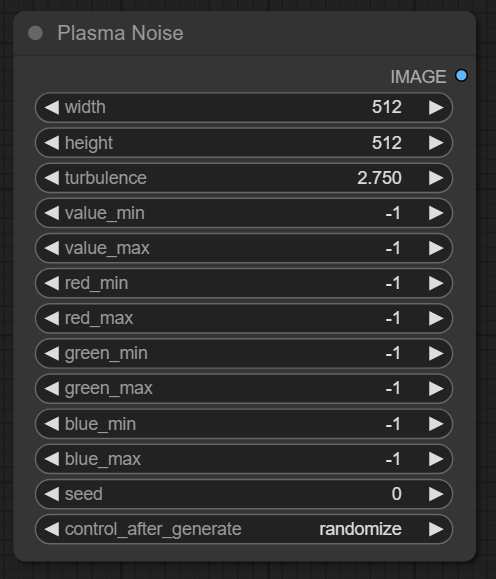
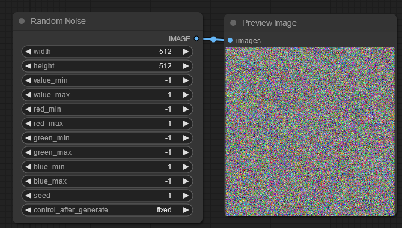
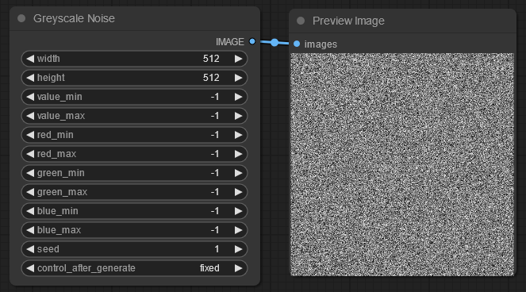
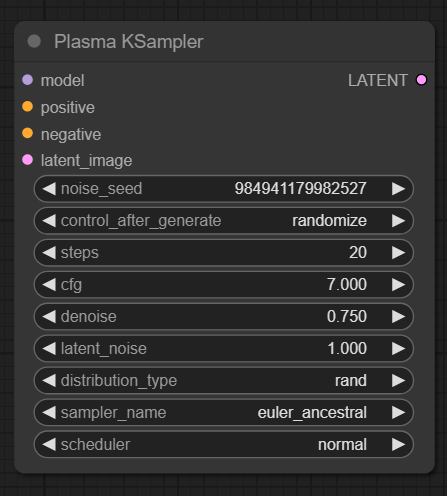
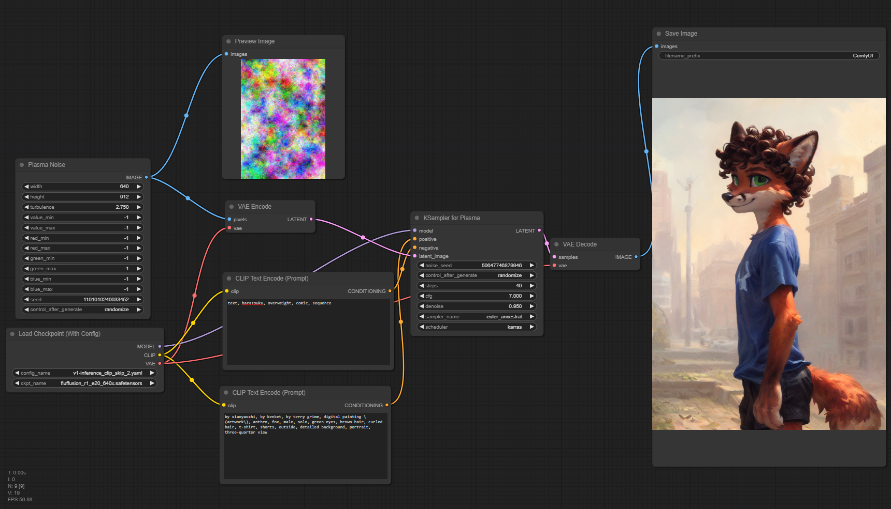
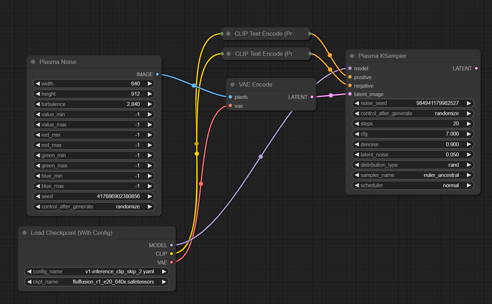
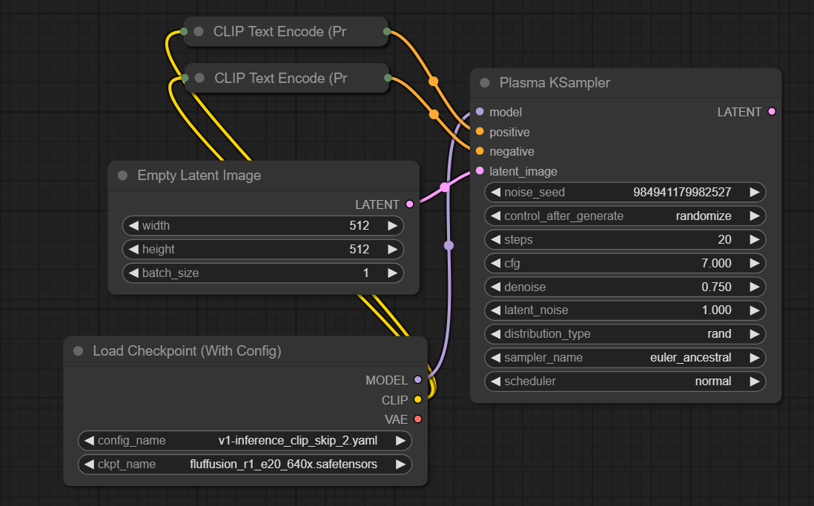

# comfy-plasma
A simple plasma noise generator for ComfyUI. Other noise generators may appear over time.

# Usage:
## Plasma Noise:

This node generates extremely noisy fractal diamond square noise clouds.

* Width, Height: Sets the generated image size as desired - steps in increments of 8.
* Turbulence: Scales the noise clouds, lower values result in smoother, larger clouds, while higher values result in more static like noise.
* Value Min/Max: Limits how dark/bright the noise can reach. -1 implies 0 and 255 for Min and Max respectively.
* Red Min/Max: Limits how strong the red channel can be. -1 Will use the settings of Value Min/Max instead of it's own setting.
* Green Min/Max: Limits how strong the green channel can be. -1 Will use the settings of Value Min/Max instead of it's own setting.
* Blue Min/Max: Limits how strong the blue channel can be. -1 Will use the settings of Value Min/Max instead of it's own setting.
* Seed: Will replicate a specific noise seed on every execution.
  * Fixed, seed stays the same after generations.
  * Increment, seed increases by 1 after generations.
  * Decrement, seed decreases by 1 after generations.
  * Randomize, seed randomly changes after generations.
____
## Random Noise:

This node generates three values per pixel, then rescales it per channel min/max values.

* Width, Height: Sets the generated image size as desired - steps in increments of 8.
* Value Min/Max: Limits how dark/bright the noise can reach. -1 implies 0 and 255 for Min and Max respectively.
* Red Min/Max: Limits how strong the red channel can be. -1 Will use the settings of Value Min/Max instead of it's own setting.
* Green Min/Max: Limits how strong the green channel can be. -1 Will use the settings of Value Min/Max instead of it's own setting.
* Blue Min/Max: Limits how strong the blue channel can be. -1 Will use the settings of Value Min/Max instead of it's own setting.
* Seed: Will replicate a specific noise seed on every execution.
  * Fixed, seed stays the same after generations.
  * Increment, seed increases by 1 after generations.
  * Decrement, seed decreases by 1 after generations.
  * Randomize, seed randomly changes after generations.
____
## Greyscale Noise:

This node generates one value per pixel then rescales it per channel min/max values. So a value pixel of 128 will scale to 63 when red is set to work between 0 and 128.

* Width, Height: Sets the generated image size as desired - steps in increments of 8.
* Value Min/Max: Limits how dark/bright the noise can reach. -1 implies 0 and 255 for Min and Max respectively.
* Red Min/Max: Limits how strong the red channel can be. -1 Will use the settings of Value Min/Max instead of it's own setting.
* Green Min/Max: Limits how strong the green channel can be. -1 Will use the settings of Value Min/Max instead of it's own setting.
* Blue Min/Max: Limits how strong the blue channel can be. -1 Will use the settings of Value Min/Max instead of it's own setting.
* Seed: Will replicate a specific noise seed on every execution.
  * Fixed, seed stays the same after generations.
  * Increment, seed increases by 1 after generations.
  * Decrement, seed decreases by 1 after generations.
  * Randomize, seed randomly changes after generations.
____
## KSampler Plasma:

* Noise Seed: The noise seed used in Latent Noise.
* Control After Generate: 
  * Fixed, seed stays the same after generations.
  * Increment, seed increases by 1 after generations.
  * Decrement, seed decreases by 1 after generations.
  * Randomize, seed randomly changes after generations.
* Steps: The number of steps the software should take while resolving your image.
* CFG: How strongly should the prompts be followed? Less CFG means more creativity, more CFG means less creativity, but more accurate prompts.
* Denoise: How much should the image be blurred to allow the model to interpret the noise/image with noise? Higher values at high resolutions can induce faces within faces. Lower values will look closer to the input image/noise but prevent faces within faces.
* Latent Noise: How strong should the built in noise be. 0 means no noise is used, and 1 means it's adding all the noise.
* Distribution Type:
  * Default, uses torch.randn() which is a gaussian distributed noise algorithm. Unable to make very dark, very bright or high contrast images.
  * Rand, uses torch.rand() whch is a truly random noise algorithm. Doesn't stick to a single random distribution and can change wildly based on input.
* Sampler Name: Pick the one that works for you best. Some may require more steps than others.
* Schedular: Pick the one that works for you best.
____
# Example Workflow:

# Using Plasma Sampler with Plasma Noise:

# Using Plasma Sampler without Plasma Noise:
